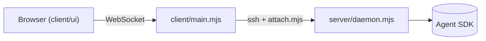

# Mermaid diagrams in IroWell

The IroWell UI draws a fenced code block whose language is `mermaid` as a diagram (Mermaid 12), with a button to see its source. Where it can't, the user sees the source as a code block, so the diagram must also read sensibly as text.

## When to draw

- Draw when the structure is the point: how steps lead into each other, which component calls which, how states change, who sends what to whom. One diagram next to the prose beats a long list of arrows in words.
- Don't draw for two or three steps in a line, for a list with no connections, or when the user asked for text only. Never use a diagram in place of the explanation: write the prose, then the diagram, or the other way round.
- One diagram per idea. Keep it under about 25 nodes; split a bigger picture into an overview and a close-up.

## Pick the type

| Showing | Type |
|---|---|
| Steps, branches, a pipeline, an architecture | `flowchart LR` (wide and short) or `flowchart TD` (a few long chains) |
| Messages between parts over time (requests, a protocol) | `sequenceDiagram` |
| States and what moves between them | `stateDiagram-v2` |
| Classes, types and how they relate | `classDiagram` |
| Tables and their keys | `erDiagram` |
| Work over time | `gantt` |
| Branches and merges | `gitGraph` |

## Write it so it parses



- Give each node a short id and put its text in quotes: `api["POST /v1/run (retry ×3)"]`. Quotes are required when the text has `()[]{}<>|#;:,` or starts with a number.
- Ids are plain words: no spaces, dots, or dashes, and never `end`, `graph`, `subgraph`, `class` or `style` (in any case) as an id.
- Edge labels: `a -->|label| b`. Line break inside a label: `<br>`.
- No backticks anywhere in the diagram, not even inside quotes: Mermaid reads them as Markdown-string markers and the whole diagram fails to parse. Write `mermaid reply`, not `` ```mermaid reply ``.
- Group with `subgraph name["Title"] … end`.
- Leave out `%%{init}%%`, `classDef`, `style`, colours and themes: the UI sets the look. Leave out `click` and links: they are switched off.
- File paths in labels are just text; to point the user at a file, link it in the prose as usual.
